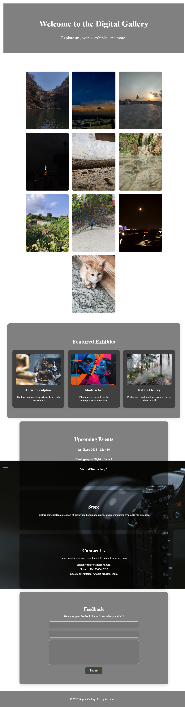

# 📸 Photo Gallery

A responsive and visually appealing **Photo Gallery** website built using **HTML** and **CSS**.  
It showcases a collection of images in a grid layout with hover effects and clean design.  

🔗 **Live Demo:** [syedsubhan1129.github.io/photo-gallery](https://syedsubhan1129.github.io/photo-gallery/)

---

## 🌟 Features

- ✅ Fully responsive layout for all devices  
- ✅ Clean and minimal user interface  
- ✅ Hover effects on images  
- ✅ Easy to customize and expand  
- ✅ Pure HTML and CSS – no frameworks used  

---

## 🖼️ Preview



---

## 🛠️ Built With

- **HTML5**  
- **CSS3**

---

## 📁 Project Structure

```
photo-gallery/
│
├── index.html          # Main HTML file
├── styles.css          # Custom CSS styles
├── images/             # Folder for gallery images
└── README.md           # Project documentation
```

---

## 🚀 Getting Started

Follow these steps to view or modify the project locally:

### 1. Clone the Repository

```bash
git clone https://github.com/Syedsubhan1129/photo-gallery.git
```

### 2. Navigate into the project

```bash
cd photo-gallery
```

### 3. Open in browser

Double-click `index.html`  
—or—  
Right-click → Open with → your browser

---

## ✏️ Customization

To personalize this gallery:

- **Change images:**  
  Replace image URLs or add your own images to the `images/` folder.

- **Edit image titles:**  
  Update the `<p>` tags below each image in `index.html`.

- **Customize layout:**  
  Modify `styles.css` to change colors, grid layout, or hover effects.

---

## 🤝 Contributing

Contributions are welcome!  
If you want to improve the layout, add animation, or make it dynamic:

1. Fork this repo  
2. Create a new branch (`git checkout -b feature-name`)  
3. Make your changes  
4. Commit your changes (`git commit -m "Add feature"`)  
5. Push to your fork (`git push origin feature-name`)  
6. Submit a pull request  

---